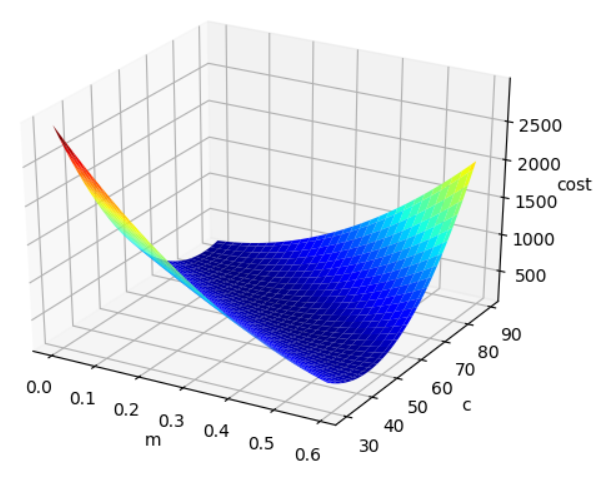
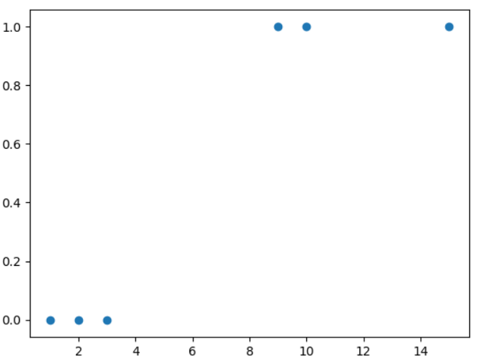
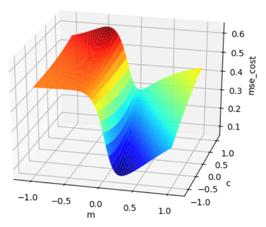
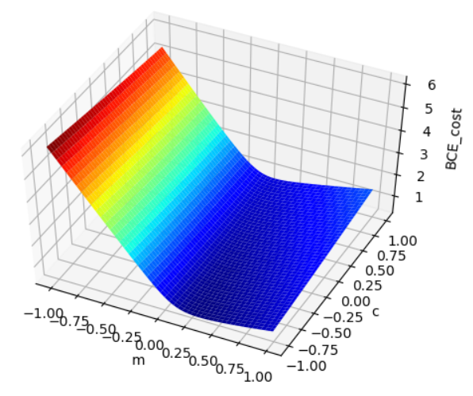

# Linear Regression MSELoss Visualization

MSE Loss 는 Linear Regression function 에 대해 Convex 하다.
예측 모델의 초기 파라미터 값의 관계 없이 gradient descent 기법을 이용하여 global optimal solution 을 구할 수 있다.

```
python visualize_linear_regression.py
```




# Logistic Regression BCELoss/MSELoss Visualization

MSE Loss 는 Logisitic(=Sigmoid) function 에 대해 Non-Convex 하다.

이런 경우 예측 모델의 초기 파라미터 값에 따라 gradient descent 기법을 이용하는 경우 global optimal solution 을 구할 수 없다.

```
python visualize_logistic_regression.py
```






