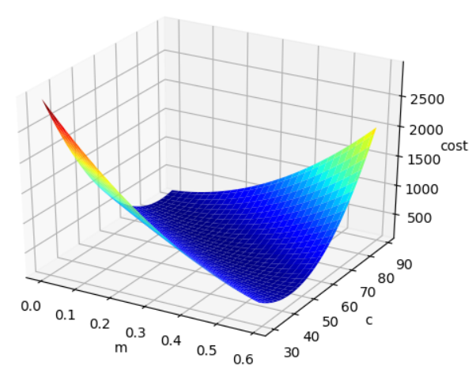
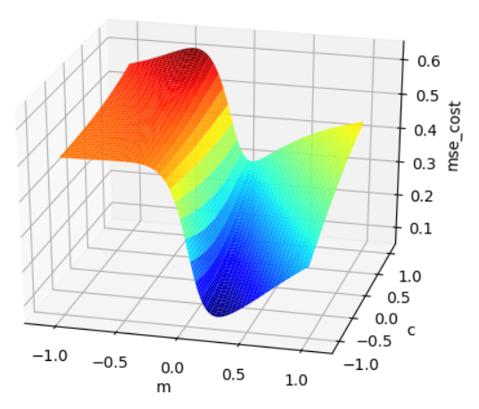
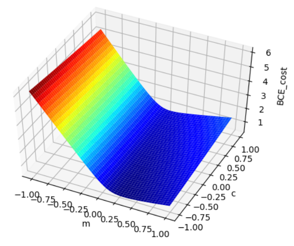

# Linear Regression MSELoss Visualization
MSE Loss 는 Linear Regression function 에 대해 Convex 하다.

```
python visualize_linear_regression.py
```




# Logistic Regression BCELoss/MSELoss Visualization

MSE Loss 는 Logisitic(=Sigmoid) function 에 대해 Non-Convex 하다.

```
python visualize_logistic_regression.py
```




